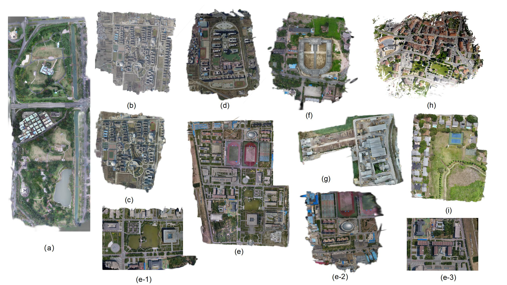

# Ortho-3DGS: True Digital Orthophoto Generation From Unmanned Aerial Vehicle Imagery Using the Depth-Regulated 3D Gaussian Splatting
Junxing Yang, Zhenglong Cai*, Tianjiao Wang, Tong Ye, Haoran Gao, He Huang (* indicates corresponding/co-first author)<br>
| [Webpage](https://repo-sam.inria.fr/fungraph/3d-gaussian-splatting/) | [Full Paper](https://ieeexplore.ieee.org/document/10930522) | [Other Publications](http://www-sop.inria.fr/reves/publis/gdindex.php) | <br>
| [Pre-trained Models (14 GB)](https://repo-sam.inria.fr/fungraph/3d-gaussian-splatting/datasets/pretrained/models.zip) | [Datasets (60MB)](https://repo-sam.inria.fr/fungraph/3d-gaussian-splatting/binaries/viewers.zip) |<br>


This repository contains the official authors implementation associated with the paper "Ortho-3DGS: True Digital Orthophoto Generation From Unmanned Aerial Vehicle Imagery Using the Depth-Regulated 3D Gaussian Splatting" published in IEEE JSTARS (2025). We further provide the reference orthophotos used to create the geometric and radiometric error metrics reported in the paper, as well as our UAV datasets featuring complex urban and geographical environments.

<a href="https://www.inria.fr/"> </a>
<a href="https://univ-cotedazur.eu/"> </a>
<a href="https://www.mpi-inf.mpg.de"> </a> 
<a href="https://team.inria.fr/graphdeco/"> </a>

Abstract: *True digital orthophoto maps (DOMs) are vital spatial data sources. However, traditional generation methods often produce significant distortions, and recent Neural Radiance Field (NeRF)-based methods struggle with training efficiency, rendering quality, and geometric accuracy without true georeferencing.We propose Ortho-3DGS, a novel method for orthophoto generation from UAV imagery. Unlike NeRF, our approach models scenes via explicit 3D Gaussian ellipsoids, optimized with depth supervision and gradient-based refinement to prevent excessive expansion and ensure accurate geometric reconstruction. Furthermore, we design a dedicated True Orthographic Rasterization rendering pipeline using parallel splatting to generate high-quality, distortion-free DOMs efficiently. Experiments show Ortho-3DGS surpasses traditional tools (ContextCapture, Pix4D) and NeRF-based methods (Ortho-NeRF, Ortho-NGP) in both radiometric and geometric performance, offering commercial-grade accuracy.*

<section class="section" id="BibTeX">
<div class="container is-max-desktop content">
<h2 class="title">BibTeX</h2>
<pre><code>@ARTICLE{yang2025ortho3dgs,
author={Yang, Junxing and Cai, Zhenglong and Wang, Tianjiao and Ye, Tong and Gao, Haoran and Huang, He},
journal={IEEE Journal of Selected Topics in Applied Earth Observations and Remote Sensing},
title={Ortho-3DGS: True Digital Orthophoto Generation From Unmanned Aerial Vehicle Imagery Using the Depth-Regulated 3D Gaussian Splatting},
year={2025},
volume={18},
pages={10972-10994},
doi={10.1109/JSTARS.2025.3552105}
}</code></pre>
</div>
</section>


## Funding and Acknowledgments
This research was supported by the Graduate Innovation Project. The authors thank the anonymous reviewers for their valuable feedback and the open-source community for laying the foundations of 3D Gaussian Splatting and Depth estimation networks.
## Step-by-step Tutorial

Jonathan Stephens made a fantastic step-by-step tutorial for setting up Gaussian Splatting on your machine, along with instructions for creating usable datasets from videos. If the instructions below are too dry for you, go ahead and check it out [here](https://www.youtube.com/watch?v=UXtuigy_wYc).

## Cloning the Repository

The repository contains submodules, thus please check it out with 
```shell
# SSH
git clone git@github.com:alexzhenglong/Ortho-3DGS.git --recursive
```


## Overview

This research was supported by the Graduate Innovation Project. The authors thank the anonymous reviewers for their valuable feedback and the open-source community for laying the foundations of 3D Gaussian Splatting and Depth estimation networks.
- A Depth-Regulated Optimizer to produce accurate 3D Gaussian models from SfM inputs, preventing over-expansion of ellipsoids.
- A Progressive Chunking mechanism to handle large-scale drone datasets without memory overflow.
- A True Orthographic Rasterizer (custom CUDA extension) to render true DOMs directly using parallel splatting.

The components have different requirements w.r.t. both hardware and software. They have been tested on Windows 10 and Ubuntu Linux 22.04. Instructions for setting up and running each of them are found in the sections below.

## 🛠 Key Features
* **Plug-and-Play Orthorectification**: A specialized method to generate DOMs **without modifying the core CUDA rasterizer**, ensuring compatibility and ease of deployment.
* **Depth-Regulated Optimization**: Prevents Gaussian ellipsoid over-expansion and ensures accurate geometric reconstruction of urban structures.
* **Large-Scale Support**: A progressive chunking mechanism allows for processing extensive drone datasets without VRAM overflow.

---

## 🚀 Workflow Pipeline

Follow these three steps to transform raw UAV imagery into high-precision DOMs.

### 1. Data Preparation
Convert raw images into a format compatible with 3DGS using COLMAP for Structure-from-Motion (SfM).

```bash
# Place raw images in <location>/input
python convert.py -s <location> --resize
```
* **Process**: Performs feature matching, triangulation, and image undistortion.
* **Output**: Creates `images/` (undistorted) and `sparse/` (camera poses) directories.

### 2. Model Training
Train the 3D Gaussian scene representation with depth constraints.

```bash
# Activate the environment
conda activate gaussian_splatting

# Run the optimizer
python train.py -s <path_to_data> -m <path_to_model> --iterations 30000
```
* **Note**: For large scenes, use `--data_device cpu` to reduce VRAM consumption.

### 3. DOM Generation (Orthorectification)
Render the trained model into a True Orthophoto.

```bash
python render_dom.py -m <path_to_trained_model> -s <path_to_data>
```

#### 💡 Implementation Highlight: Rasterizer-Independent Correction
One of our key contributions is the ability to perform orthorectification **without altering the underlying rasterization engine**:
* **The Logic**: Instead of rewriting the complex CUDA kernels of the `diff-gaussian-rasterization` library, we implement a **Virtual Orthographic Camera** approach.
* **The Method**: By mathematically transforming the viewing and projection matrices (or projecting Gaussians onto a normalized horizontal datum), we leverage the standard real-time splatting pipeline to output distortion-free, georeferenced DOMs directly.

---

## 💻 Requirements
* **OS**: Windows 10 / Ubuntu 22.04
* **GPU**: CUDA-ready GPU (Compute 7.0+), **24GB VRAM** recommended.
* **Software**: CUDA SDK **11.8** (Important: CUDA 11.6 and 12.x are known to cause issues).

## BibTeX
If you find this work useful for your research, please cite:

```bibtex
@ARTICLE{yang2025ortho3dgs,
  author={Yang, Junxing and Cai, Zhenglong and Wang, Tianjiao and Ye, Tong and Gao, Haoran and Huang, He},
  journal={IEEE Journal of Selected Topics in Applied Earth Observations and Remote Sensing},
  title={Ortho-3DGS: True Digital Orthophoto Generation From Unmanned Aerial Vehicle Imagery Using the Depth-Regulated 3D Gaussian Splatting},
  year={2025},
  volume={18},
  pages={10972-10994},
  doi={10.1109/JSTARS.2025.3552105}
}
```
